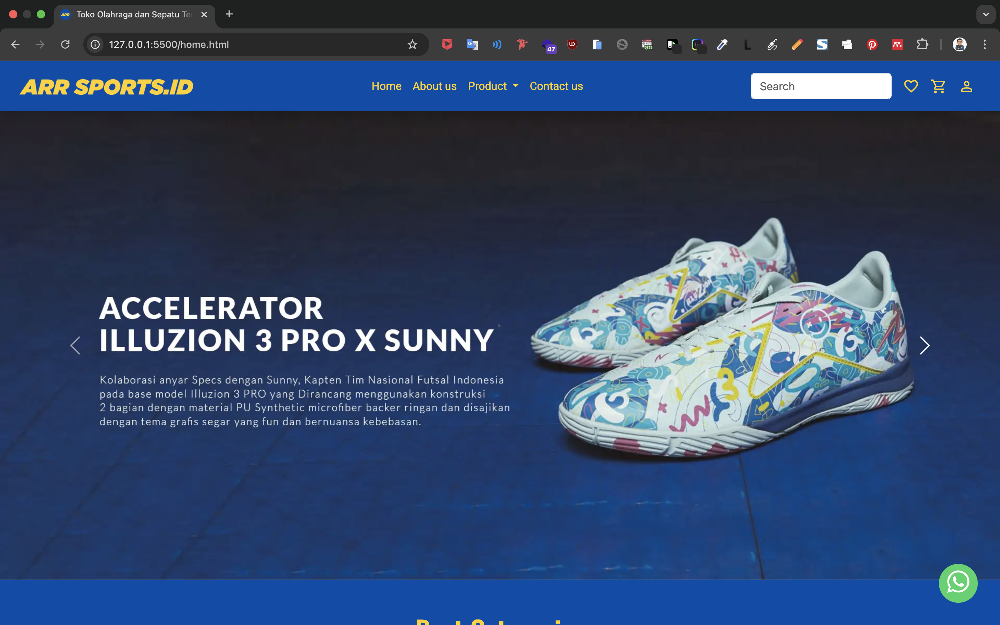
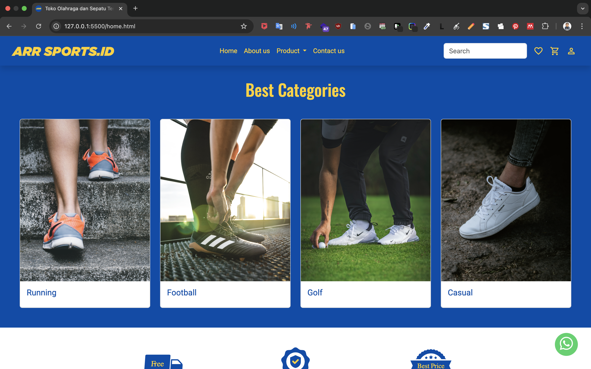
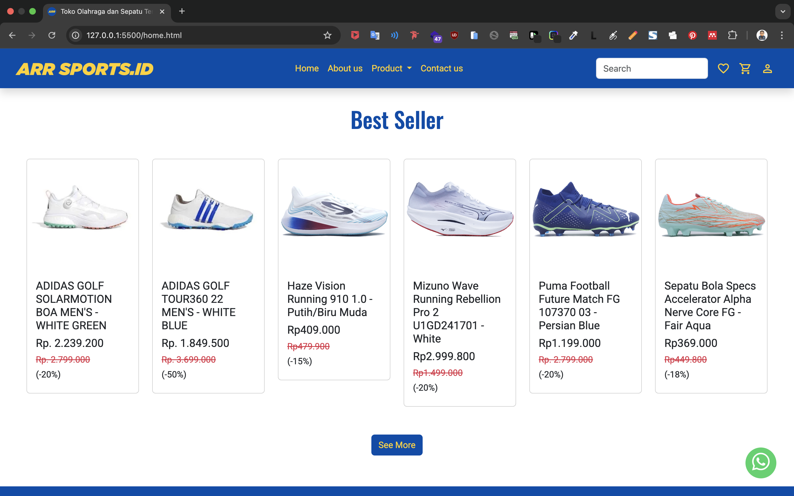
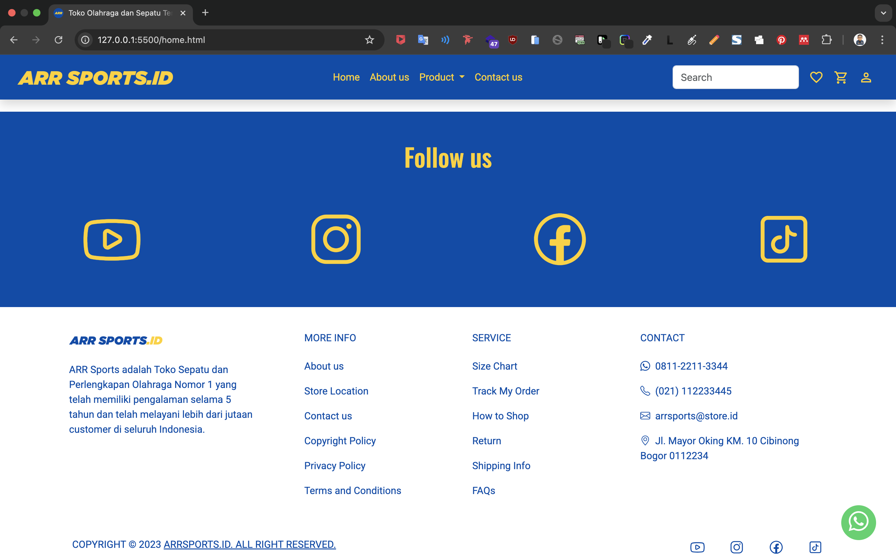
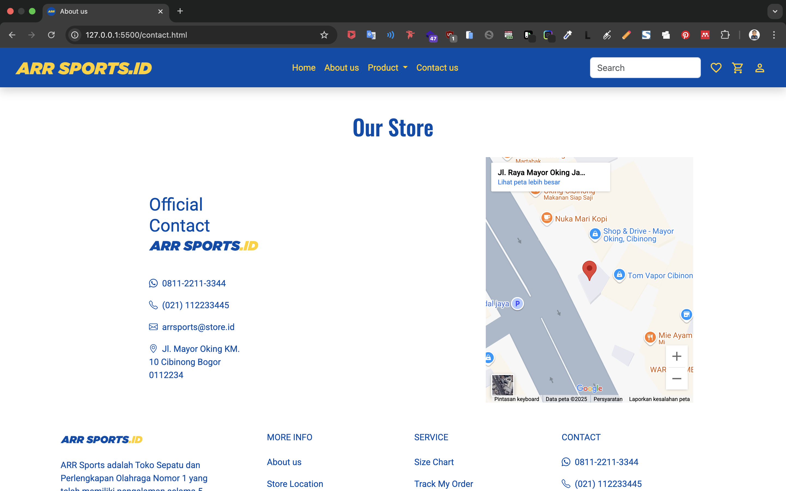
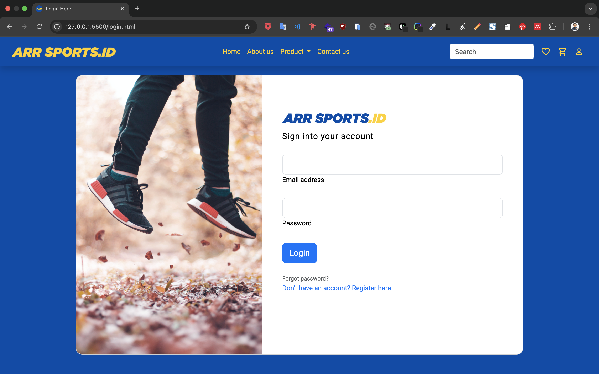

# 👟 ARRSports.id – Website Toko Olahraga dan Sepatu

**ARRSports** adalah sebuah proyek website toko online penjualan sepatu yang masih berupa tampilan frontend (tanpa backend). Website ini dirancang dengan tampilan modern, bersih, dan responsif, sehingga dapat diakses dengan baik di berbagai perangkat, mulai dari desktop hingga smartphone.

Proyek ini cocok digunakan sebagai dasar atau referensi untuk membangun sistem e-commerce sederhana khususnya di bidang fashion/footwear.

---

## 🎯 Fitur Utama

- 🏠 **Landing Page** modern
- 📦 **Katalog Produk Sepatu**
- 📱 **Desain Responsif** (Responsive Web Design) – Mendukung tampilan mobile & tablet
- 🎨 **Desain UI Menggunakan Bootstrap CSS**

---

## 🛠 Teknologi yang Digunakan

- 🌐 **HTML5**
- 🎨 **CSS3 + Bootstrap 5**
- 📱 **RWD (Responsive Web Design)** dengan media queries & grid system Bootstrap

---

## 🔧 Cara Menjalankan Proyek

1. **Clone Repository**:

   ```bash
   git clone https://github.com/username/ARRSports.git
   cd ARRSports
   ```

2. **Buka file `home.html` di browser**:
   Kamu bisa cukup klik dua kali file `home.html`, atau gunakan live server seperti pada VS Code untuk preview yang lebih interaktif.

## 🧪 Tampilan Website








---

## 📱 Desain Responsif

ARRSports telah diuji dan dirancang agar tampak baik di berbagai ukuran layar:

* ✅ Mobile-friendly (≤768px)
* ✅ Tablet (768px–1024px)
* ✅ Desktop (≥1024px)

---

## 👨‍💻 Kontributor

Proyek ini dikembangkan oleh:

- 📸 **Instagram**: [@rifairmdhnn_](https://instagram.com/rifairmdhnn_)
- 💼 **LinkedIn**: [Achmad Rifa'i Ramadhan](https://www.linkedin.com/in/achmadrifairamadhan/)

---

## ☕ Dukung Kami

Jika proyek ini bermanfaat bagi Anda, dukung pengembangannya melalui:

- ☕ [Buy Me a Coffee](https://lynk.id/rifairmdhnn_)

---

## 📄 Lisensi

Proyek ini dilisensikan di bawah [MIT License](LICENSE).

---